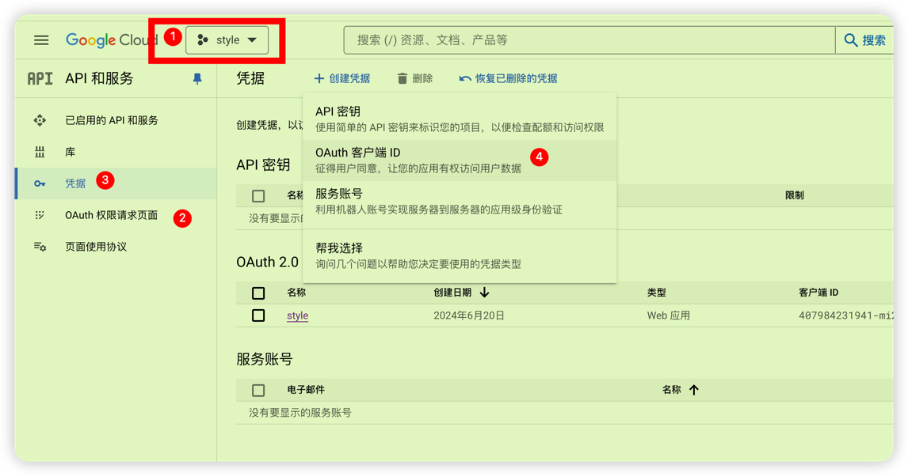
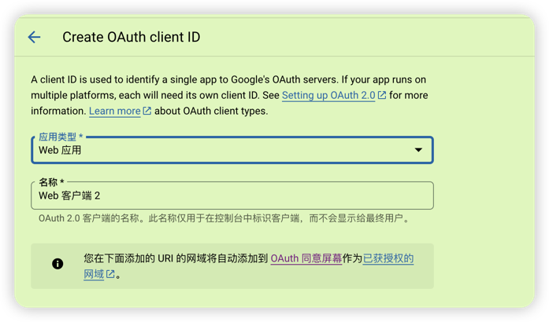
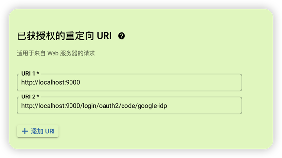

## 前言
本项目是基于官方demo扩展的一个 用于学习理解authorization-server

## 模块说明
| 模板名                     | 说明                                 |
|-------------------------|------------------------------------|
| ss-oauth                | 父pom 定义了spring boot spring cloud版本 |
| auth-service            | 认证服务器  提供认证的服务                     |
| message-resource-server | 消息资源服务                             |
| user-resource-server    | 用户资源服务                             |
| user-client             | 用户客户端                              |
| github-client           | 集成GitHub登录的演示项目                    |

## 模块详细说明

### auth-server
认证服务器 提供认证的服务
com.style.auth.authentication 包下为 扩展的认证方式 这里是device-client授权
com.style.auth.config.AuthorizationServerConfig auth-server核心配置类 
com.style.auth.config.SecurityConfig Security的配置类
com.style.auth.federation 包下为扩展 例如 认证成功后的处理器 AuthenticationSuccessHandler  OAuth2TokenCustomizer
com.style.auth.jose 包为 ras的密钥生成工具
com.style.auth.web 包为一些扩展的接口controller 例如 login接口 device认证相关接口 认证授权接口
application.yaml 核心配置文件 配置了 github和google 登录授权的client的 相关信息需要自行申请

### message-resource-server
消息资源服务
com.style.message.config.ResourceServerConfig 核心配置类 主要配置了 /messages/** 需要认证以及SCOPE_message.read 权限

### user-resource-server
用户消息资源服务
com.style.user.config.ResourceServerConfig 核心配置类 主要配置了 /user/** 需要认证以及 SCOPE_user.read 权限

### user-client
可以理解为这是个组合页面  用来调试这几个认证模式 授权码 以及 客户端凭证 以及 token传递 (认证后,通过透传token信息,来访问其他的服务接口)
com.style.client.authorization 包下 扩展的认证方式 这里是device-client的请求 以及认证(OAuth2AuthorizedClientProvider)
com.style.client.config.SecurityConfig 核心配置类 
com.style.client.config.WebClientConfig 主要用来配置webClient以及OAuth2AuthorizedClientManager
com.style.client.web包 主要是一些认证的接口 AuthorizationController 以及用于 deviceClient认证的接口

## 使用说明

github-client 是独立的项目 不依赖与其他的子项目 主要功能 集成GitHub登陆的页面 同时自定义了用户service以及OAuth2User 

auth-service 和 message-resource-server 和 user-resource-server 和 user-client  这四个项目一起 
主要功能是用于学习理解authorization-server的演示demo 

启动步骤 先启动 auth-service 其他的3个无要求 按个启动即可.

## 其他说明
- 使用auth-service的github登录和google登录 需要梯子 不然请求他们接口容易网络超时.
- auth-service中的github登录和google登录的client id client-secret 需要自行申请
  github的oauth client申请比较简单 地址  https://github.com/settings/developers 直接新增oauth app即可
  但是 google的oauth client的申请就比较繁琐 地址 https://console.cloud.google.com/ 需要先新建项目,然后选择OAuth consent screen
  其次在点到凭据 进行新增凭据 选择oauth客户端ID 然后进行配置如下图 
  
  
   配置 已获授权的重定向 URI http://localhost:9000 http://localhost:9000/login/oauth2/code/google-idp
  
  